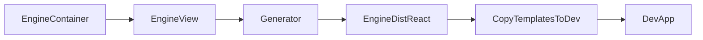

# Engine + Generator Refactor Plan

## Goals
- Generator (React plugin) emits props only from function signatures; no variable-based inference.
- Engine `layouts` and `routes` split into Container + View: Containers compute context/router data and are NOT generated; Views are pure-props and are generated.
- Generated `apps/engine/dist/react` and copied `apps/dev/src` stay stable after updates.

## Key Changes
- Update generator prop-emission logic to **remove variable inference** and rely only on explicit props from source signatures.
- Add container/view structure in `apps/engine/src/layouts` and `apps/engine/src/routes` and adjust imports/exports so only View files are in generation source directories.
- Adjust app routing to use Containers (engine/dev) while generator reads only Views.

## Files to Touch (expected)
- Generator:
  - `[packages/generator/src/plugins/template/built-in/ReactPlugin.ts](e:/_@Bun/@ui8kit-framework/packages/generator/src/plugins/template/built-in/ReactPlugin.ts)` — remove `collectVariables` fallback for props.
  - `[packages/generator/src/transformer/hast-builder.ts](e:/_@Bun/@ui8kit-framework/packages/generator/src/transformer/hast-builder.ts)` — keep preamble support, but props are signature-only.
- Engine (Layouts/Routes):
  - `[apps/engine/src/layouts](e:/_@Bun/@ui8kit-framework/apps/engine/src/layouts)` — create `*View.tsx` (pure props) + `*Container.tsx` (context/router).
  - `[apps/engine/src/routes](e:/_@Bun/@ui8kit-framework/apps/engine/src/routes)` — same split for routes using context.
  - `[apps/engine/src/App.tsx](e:/_@Bun/@ui8kit-framework/apps/engine/src/App.tsx)` — route to Containers.
  - `[apps/engine/src/layouts/index.ts](e:/_@Bun/@ui8kit-framework/apps/engine/src/layouts/index.ts)` and `[apps/engine/src/routes/index.ts](e:/_@Bun/@ui8kit-framework/apps/engine/src/routes/index.ts)` — export Containers for app usage; export Views for generator if needed.
- Generator config:
  - `[apps/engine/generator.config.ts](e:/_@Bun/@ui8kit-framework/apps/engine/generator.config.ts)` — change `REGISTRY_SOURCE_DIRS` to point at `src/layouts/views` and `src/routes/views` (or similar) so only views are generated.

## Plan Steps
1. **Generator: remove props inference**
   - In `ReactPlugin.getEmittedPropNames()`, return only `tree.meta.props` (from function signature). If none, emit no props.
   - Ensure no fallback to `collectVariables`.

2. **Engine: create Container/View structure (layouts + routes)**
   - Create directories: `src/layouts/views`, `src/layouts/containers`, `src/routes/views`, `src/routes/containers`.
   - Move existing layout/route implementation into View files with **explicit props signature only** (no context/useLocation). Example: `ExamplesLayoutView` accepts `{ tabs, examples, children }`.
   - Add Container files that compute data (context/useLocation) and render the View.

3. **Wire app to Containers; generator to Views**
   - Update `apps/engine/src/App.tsx` to use Containers.
   - Update `generator.config.ts` to scan only View folders for layouts/routes.
   - Update any barrel exports used by engine/dev so Containers are imported in app runtime, Views only used by generator.

4. **Validate pipeline**
   - Run `bun run generate` in `apps/engine` and `bun run copy-templates-to-dev`.
   - Verify generated `apps/engine/dist/react/layouts/*` and `routes/*` contain no context/useLocation and props come only from signatures.
   - Confirm `apps/dev/src` contains correct layouts/routes and no prop conflicts.

## Notes
- This design eliminates accidental props collisions like `const { title } = props` + `const { title } = context...` in generated output.
- Containers are small, stable, and not part of the generated template surface.

## Mermaid Overview

## Todos
- generator-remove-inference: Remove prop inference from ReactPlugin
- engine-split-views: Split layouts/routes into Container/View
- generator-sources: Point generator registry to Views
- regen-and-copy: Regenerate and copy to dev; verify output
